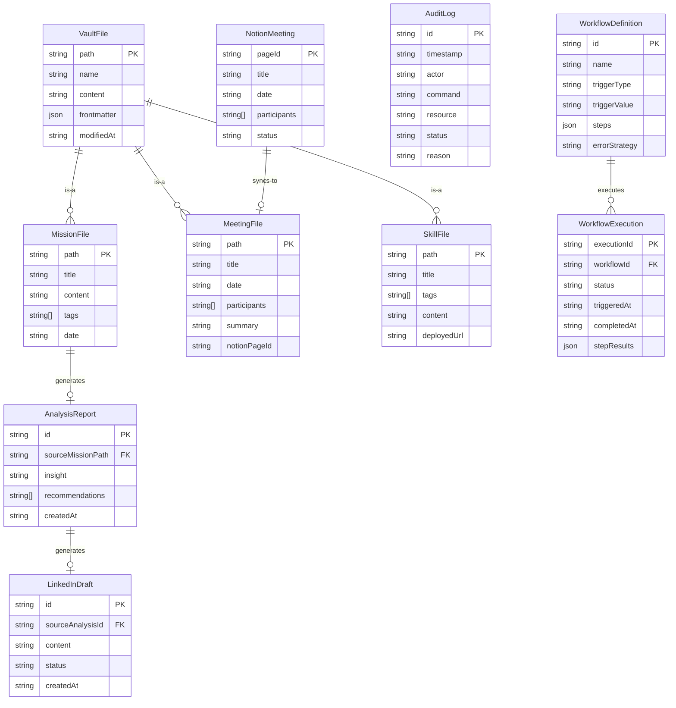

# ERD 설계서

작성일: 2026-05-01  
프로젝트: 셀피시 클럽 AI 에이전트 협업 시스템  
버전: v1.0

> 본 시스템은 별도의 관계형 DB를 사용하지 않는다.  
> 데이터는 파일 시스템(Markdown/JSON) 및 외부 서비스(Notion, GitHub)에 저장된다.  
> 이 문서는 시스템에서 다루는 핵심 도메인 엔티티와 그 관계를 정의한다.

---

## 1. 도메인 엔티티 다이어그램

---

## 2. 엔티티 상세 정의

### 2.1 VaultFile

Obsidian 볼트 내 모든 Markdown 파일의 기본 단위.

| 필드 | 타입 | 설명 |
|------|------|------|
| `path` | string | 파일 절대 경로 (PK) |
| `name` | string | 파일명 |
| `content` | string | Markdown 본문 |
| `frontmatter` | Record<string, unknown> | YAML frontmatter |
| `modifiedAt` | ISO 8601 string | 최종 수정일 |

---

### 2.2 MissionFile

미션/목표를 기록하는 특수 Markdown 파일.

| 필드 | 타입 | 설명 |
|------|------|------|
| `path` | string | 파일 경로 (PK) |
| `title` | string | 미션 제목 |
| `content` | string | 미션 내용 |
| `tags` | string[] | `['mission']` 태그 포함 |
| `date` | string | 작성일 |

---

### 2.3 MeetingFile

회의 내용을 기록하는 Markdown 파일. Notion과 양방향 동기화.

| 필드 | 타입 | 설명 |
|------|------|------|
| `path` | string | 파일 경로 (PK) |
| `title` | string | 회의 제목 |
| `date` | string | 회의일 |
| `participants` | string[] | 참석자 목록 |
| `summary` | string | 요약 |
| `notionPageId` | string | 연결된 Notion 페이지 ID |

---

### 2.4 AnalysisReport

Claude AI가 MissionFile을 분석하여 생성하는 리포트. 메모리 내 관리.

| 필드 | 타입 | 설명 |
|------|------|------|
| `id` | string | UUID (PK) |
| `sourceMissionPath` | string | 분석 대상 MissionFile 경로 (FK) |
| `insight` | string | 분석 인사이트 |
| `recommendations` | string[] | 권장 액션 목록 |
| `createdAt` | ISO 8601 string | 생성일 |

---

### 2.5 WorkflowDefinition

오케스트레이터에 등록된 워크플로우 정의. 코드 내 정의 (tasks.json 미사용).

| 필드 | 타입 | 설명 |
|------|------|------|
| `id` | string | 워크플로우 ID (PK) |
| `name` | string | 워크플로우 명칭 |
| `triggerType` | `'event'` \| `'cron'` | 트리거 유형 |
| `triggerValue` | string | 이벤트명 또는 cron 표현식 |
| `steps` | WorkflowStep[] | 실행 단계 배열 |
| `errorStrategy` | `'stop'` \| `'continue'` \| `'retry'` | 오류 처리 전략 |

---

### 2.6 WorkflowExecution

워크플로우 실행 이력. 메모리 내 관리.

| 필드 | 타입 | 설명 |
|------|------|------|
| `executionId` | string | UUID (PK) |
| `workflowId` | string | 실행된 워크플로우 ID (FK) |
| `status` | `'completed'` \| `'failed'` | 실행 결과 |
| `triggeredAt` | ISO 8601 string | 시작 시각 |
| `completedAt` | ISO 8601 string | 완료 시각 |
| `stepResults` | StepResult[] | 각 단계 결과 |

---

### 2.7 AuditLog

CLI 명령 실행의 감사 로그. `audit/audit.log` 파일에 append.

| 필드 | 타입 | 설명 |
|------|------|------|
| `id` | string | 로그 항목 ID (PK) |
| `timestamp` | ISO 8601 string | 기록 시각 |
| `actor` | string | 실행 주체 |
| `command` | string | 실행 명령 |
| `resource` | string | 대상 리소스 |
| `status` | `'success'` \| `'failure'` | 결과 |
| `reason` | string? | 실패 사유 |

---

## 3. 데이터 저장 위치 요약

| 엔티티 | 저장 위치 |
|--------|-----------|
| VaultFile / MissionFile / MeetingFile / SkillFile | 로컬 파일 시스템 (Markdown) |
| NotionMeeting | Notion Database |
| GitHub 커밋 이력 | GitHub Repository |
| AnalysisReport / LinkedInDraft / WorkflowExecution | 메모리 (런타임) |
| AuditLog | `audit/audit.log` (로컬 파일) |
| 설정 | `selfish-club.config.json` (로컬 파일) |

---

## 4. 변경 이력

| 버전 | 날짜 | 변경 내용 | 작성자 |
|------|------|-----------|--------|
| v1.0 | 2026-05-01 | 최초 작성 | 피터판돌 |
