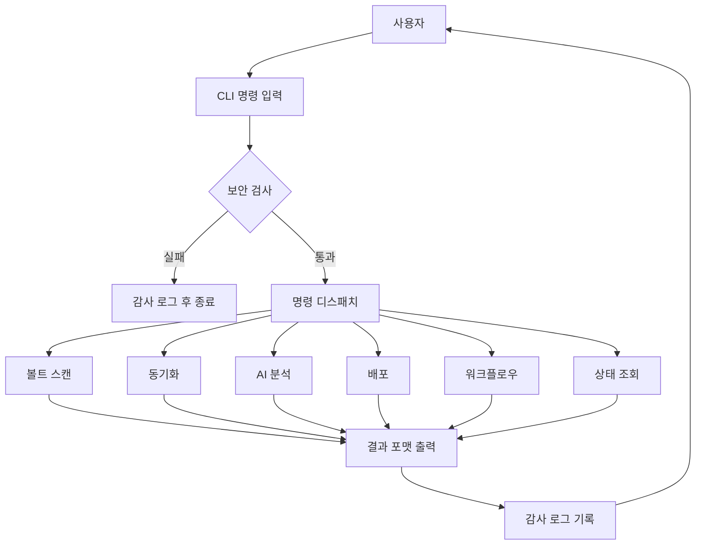
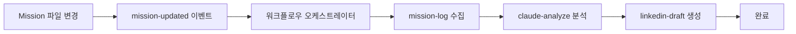
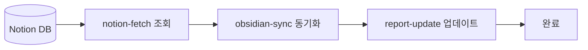
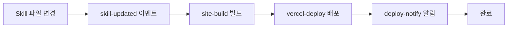
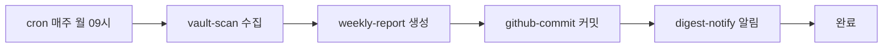
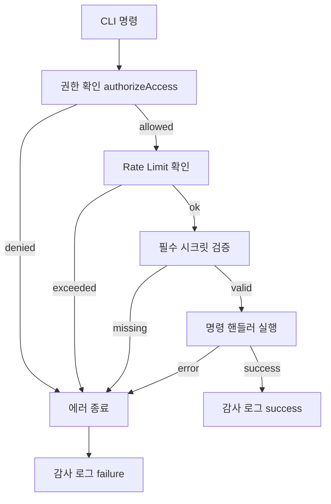
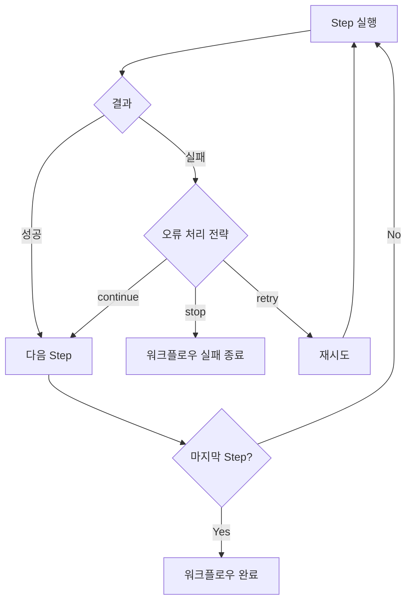

# FLOW CHART

작성일: 2026-05-01  
프로젝트: 셀피시 클럽 AI 에이전트 협업 시스템  
버전: v1.1

> 상세 실행 흐름은 `프로그램 흐름도.md` 참고. 본 문서는 비즈니스 레벨 플로우를 정의한다.

---

## 1. 전체 시스템 플로우

---

## 2. Mission 업데이트 자동화 플로우 (`onMissionUpdate`)

---

## 3. 미팅 동기화 플로우 (`onMeetingSync`)

---

## 4. 스킬 배포 플로우 (`onSkillUpdate`)

---

## 5. 주간 다이제스트 플로우 (`weeklyDigest` — 매주 월요일 09:00)

---

## 6. 보안 처리 플로우

---

## 7. 워크플로우 Step 오류 처리 플로우

---

## 8. 변경 이력

| 버전 | 날짜 | 변경 내용 | 작성자 |
|------|------|-----------|--------|
| v1.0 | 2026-05-01 | 최초 작성 | 피터판돌 |
| v1.1 | 2026-05-01 | Mermaid 문법 오류 수정 (콜론 라벨, \n 제거) | 피터판돌 |
