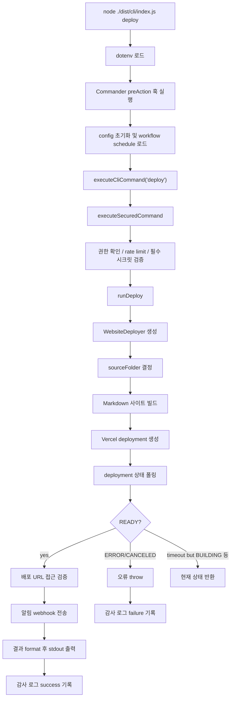

# 기능 작동 분석 Mission 분석

## 요약

이번 주 회의에서는 `node ./dist/cli/index.js deploy` 명령어의 작동 방식에 대한 분석을 진행했습니다. 이 명령어는 Skill/Insight 사이트를 Vercel에 배포하는 과정에서의 전체 흐름, 보안 절차, 배포 요청 및 상태 확인 방법, Markdown 파일을 HTML로 변환하는 빌드 과정, 그리고 최종 결과 출력 형식에 대해 상세히 설명했습니다.

## 하이라이트

- CLI 명령어 `node ./dist/cli/index.js deploy`의 기능 분석
- 배포 과정에서의 보안 및 권한 확인 절차 설명
- Vercel API를 통한 배포 요청 및 상태 폴링 메커니즘 설명
- Markdown 파일을 HTML로 변환하는 빌드 프로세스 설명
- 배포 후 알림 전송 및 결과 출력 형식 설명

## 키워드

- deploy (빈도: 20, 관련성: 0.90)
- Vercel (빈도: 15, 관련성: 0.85)
- CLI (빈도: 12, 관련성: 0.80)
- Markdown (빈도: 10, 관련성: 0.75)
- build (빈도: 8, 관련성: 0.70)
- audit log (빈도: 6, 관련성: 0.65)
- environment variables (빈도: 5, 관련성: 0.60)
- notification webhook (빈도: 4, 관련성: 0.55)
- rate limit (빈도: 3, 관련성: 0.50)
- security (빈도: 3, 관련성: 0.50)

## 트렌드

이번 주 회의에서는 `node ./dist/cli/index.js deploy` 명령어의 작동 방식에 대한 분석을 진행했습니다. 이 명령어는 Skill/Insight 사이트를 Vercel에 배포하는 과정에서의 전체 흐름, 보안 절차, 배포 요청 및 상태 확인 방법, Markdown 파일을 HTML로 변환하는 빌드 과정, 그리고 최종 결과 출력 형식에 대해 상세히 설명했습니다.

## 원문

# `node ./dist/cli/index.js deploy` 기능 작동 분석서

  

분석일: 2026-05-11

  

## 1. 분석 대상

  

```bash

node ./dist/cli/index.js deploy

```

  

이 명령은 빌드된 CLI 엔트리포인트(`dist/cli/index.js`)를 통해 `deploy` 서브커맨드를 실행한다. TypeScript 원본 기준 주요 구현은 다음 파일에 있다.

  

- `src/cli/index.ts`: CLI 명령 등록, 공통 옵션 처리, 보안 래퍼 호출

- `src/cli/security.ts`: 권한 확인, rate limit, 필수 시크릿 검증, 감사 로그 기록

- `src/cli/commands.ts`: `runDeploy()` 구현

- `src/workflows/website-deployer.ts`: 사이트 빌드, Vercel 배포, 상태 조회, URL 검증, 알림 전송

- `src/types/deployer.ts`: 배포 관련 타입 정의

  

`node ./dist/cli/index.js deploy --help` 실행 결과 기준으로 명령은 다음 옵션을 제공한다.

  

```text

Usage: selfish-club deploy [options]

  

Skill/Insight 사이트를 Vercel에 배포합니다

  

Options:

  --preview   프리뷰 배포로 실행 (default: false)

  -h, --help  display help for command

```

  

## 2. 전체 실행 흐름

  



  

## 3. CLI 진입과 옵션 처리

  

`src/cli/index.ts`에서 `deploy` 명령은 다음처럼 등록된다.

  

- `program.command('deploy')`

- 옵션: `--preview`, 기본값 `false`

- 실행 핸들러:

  - 부모 명령의 `--output` 값을 읽는다. 기본값은 `table`이다.

  - `executeCliCommand('deploy', opts, async () => runDeploy(...))`를 호출한다.

  - 반환 문자열을 `console.log()`로 출력한다.

  

루트 CLI에는 공통 옵션도 있다.

  

- `-o, --output <format>`: `table | json | minimal`, 기본값 `table`

- `--log-level <level>`: `debug | info | warn | error`, 기본값 `info`

  

따라서 JSON으로 결과를 보고 싶으면 다음처럼 실행한다.

  

```bash

node ./dist/cli/index.js --output json deploy

```

  

프리뷰 배포는 다음처럼 실행한다.

  

```bash

node ./dist/cli/index.js deploy --preview

```

  

## 4. 사전 처리: dotenv, 설정, 스케줄 로드

  

CLI 시작 시 `loadDotenv()`가 실행되어 `.env` 값을 `process.env`로 로드한다.

  

명령 실행 전 `preAction` 훅에서 다음 작업이 수행된다.

  

1. `--log-level` 값을 logger에 반영한다.

2. `ConfigManager.init()`으로 `selfish-club.config.json`을 초기화 또는 로드한다.

3. 저장된 workflow schedule 목록을 읽어 `WorkflowOrchestrator`에 등록한다.

4. 설정 경로와 로그 레벨을 debug 로그로 남긴다.

  

이 단계는 deploy 자체의 핵심 배포 로직은 아니지만, 모든 CLI 명령 공통으로 실행된다.

  

## 5. 보안 래퍼 동작

  

`deploy`는 실제 작업 전에 `executeSecuredCommand()`를 통과한다.

  

### 5.1 리소스 식별자

  

`buildCommandResource()`는 deploy 명령의 리소스를 다음처럼 만든다.

  

- 일반 배포: `deploy/production`

- 프리뷰 배포: `deploy/preview`

  

### 5.2 권한 확인

  

`deploy` 명령은 `mapCommandToAction()`에서 `manage` 액션으로 매핑된다. 기본 actor는 다음 환경 변수로 결정된다.

  

- `SELFISH_ACTOR_ROLE`: `Admin | Member | Viewer`, 기본값 `Admin`

- `SELFISH_ACTOR_ID`: 기본값 `local-admin`

  

기본값이 `Admin`이므로 일반 로컬 실행에서는 권한 통과 가능성이 높다.

  

### 5.3 Rate limit

  

기본 rate limit은 actor와 명령 조합 기준이다.

  

- key: `${actor.id}:deploy`

- 기본 제한: 60초에 30회

- 환경 변수:

  - `SELFISH_RATE_LIMIT`

  - `SELFISH_RATE_LIMIT_WINDOW_MS`

  

### 5.4 필수 시크릿 검증

  

`getRequiredSecretsForCommand('deploy')` 결과는 다음이다.

  

```text

VERCEL_TOKEN

VERCEL_PROJECT_ID

```

  

둘 중 하나라도 비어 있으면 deploy 실행 전 실패한다. 검증은 `SecretManager`가 환경 변수에서 값을 로드한 뒤 수행한다.

  

### 5.5 감사 로그

  

성공 또는 실패 결과는 `audit/audit.log`에 기록된다.

  

- 성공: `status: success`

- 실패: `status: failure`, 오류 메시지 metadata 포함

  

## 6. `runDeploy()` 상세 흐름

  

`src/cli/commands.ts`의 `runDeploy()`가 deploy의 중심 로직이다.

  

실행 순서는 다음과 같다.

  

1. `preview = opts.preview ?? false`

2. `createWebsiteDeployerFromEnv()`로 `WebsiteDeployer` 생성

3. `resolveWebsiteDeploySourceFolder()`로 배포할 Markdown 폴더 결정

4. `deployer.buildSite(sourceFolder)` 실행

5. `deployer.deployToVercel(buildResult.outputPath, { preview })` 실행

6. `deployer.waitForDeploymentReady(deployment.deploymentId, pollingOptions)` 실행

7. 배포 생성 응답과 상태 조회 응답을 병합

8. Vercel `readyState`를 CLI 상태로 매핑

9. 실패 또는 취소 상태면 오류 throw

10. 완료 상태면 배포 URL 접근 검증

11. 완료 상태면 notification webhook 전송

12. 결과 객체를 `table | json | minimal` 형식으로 변환해 반환

  

## 7. 환경 변수

  

### 7.1 필수

  

| 환경 변수 | 용도 |

| --- | --- |

| `VERCEL_TOKEN` | Vercel API Authorization Bearer 토큰 |

| `VERCEL_PROJECT_ID` | Vercel deployment payload의 `name`, `project` 값 |

  

### 7.2 선택

  

| 환경 변수 | 기본값 | 용도 |

| --- | --- | --- |

| `VERCEL_TEAM_ID` | 없음 | Vercel API query string에 `teamId` 추가 |

| `NOTIFICATION_WEBHOOK_URL` | 없음 | 배포 완료 후 webhook 알림 전송 |

| `WEBSITE_DEPLOY_SOURCE_FOLDER` | 없음 | 배포 대상 Markdown 폴더를 직접 지정 |

| `VAULT_PATH` | `./vault` | 기본 배포 소스 계산용 vault 루트 |

| `VAULT_FOLDER_SKILL_INSIGHT` | `skillInsight` | 기본 배포 소스 폴더명 |

| `DEPLOY_STATUS_MAX_ATTEMPTS` | `24` | Vercel 상태 폴링 최대 횟수 |

| `DEPLOY_STATUS_POLL_INTERVAL_MS` | `5000` | Vercel 상태 폴링 간격(ms) |

| `DEPLOY_VERIFY_MAX_ATTEMPTS` | `10` | 배포 URL 접근 검증 최대 횟수 |

| `DEPLOY_VERIFY_INTERVAL_MS` | `3000` | 배포 URL 접근 검증 간격(ms) |

| `SELFISH_ACTOR_ROLE` | `Admin` | CLI 권한 actor role |

| `SELFISH_ACTOR_ID` | `local-admin` | CLI 권한 actor id |

| `SELFISH_RATE_LIMIT` | `30` | rate limit 허용 횟수 |

| `SELFISH_RATE_LIMIT_WINDOW_MS` | `60000` | rate limit 시간 창(ms) |

  

## 8. 배포 소스 폴더 결정

  

`resolveWebsiteDeploySourceFolder()`는 다음 우선순위로 소스 폴더를 결정한다.

  

1. `WEBSITE_DEPLOY_SOURCE_FOLDER`가 있으면 `path.resolve()`한 값을 사용

2. 없으면 `path.resolve(VAULT_PATH ?? './vault', VAULT_FOLDER_SKILL_INSIGHT ?? 'skillInsight')`

  

현재 기본값 기준 배포 대상은 다음이다.

  

```text

D:\TM_PROJECT_셀피시\코드엑스개발\vault\skillInsight

```

  

## 9. 사이트 빌드 동작

  

`WebsiteDeployer.buildSite(sourceFolder)`는 지정 폴더의 `.md` 파일만 대상으로 정적 HTML 사이트를 만든다.

  

### 9.1 입력

  

- `sourceFolder` 바로 아래의 `.md` 파일

- 하위 폴더는 빌드 입력으로 순회하지 않는다.

- Markdown frontmatter는 `gray-matter`로 파싱한다.

  

### 9.2 페이지 정보 생성

  

각 Markdown 파일마다 다음 정보를 만든다.

  

- `slug`: 파일명에서 `.md` 제거

- `title`: frontmatter의 `title`, 없으면 파일명 기반 제목

- `category`: frontmatter의 `category` 또는 제목 키워드 기반 분류

- `htmlContent`: 간단 Markdown 변환 결과

- `markdownSource`: frontmatter 제거 후 본문

- `searchText`: 제목과 본문을 합친 lowercase 문자열

  

### 9.3 카테고리 분류

  

frontmatter `category`가 아래 값 중 하나면 그대로 사용한다.

  

- `ai-tools`

- `platform`

- `insights`

- `uncategorized`

  

없거나 유효하지 않으면 제목 키워드를 기준으로 분류한다. 매칭되지 않으면 `uncategorized`가 된다.

  

### 9.4 Markdown 변환 범위

  

현재 변환기는 단순 규칙 기반이다.

  

- `#`, `##`, `###` 제목

- `- ` 목록 항목

- `1. ` 숫자 목록 항목

- 일반 문단

- inline: `**bold**`, `*em*`, `` `code` ``, `[text](url)`

  

주의할 점은 목록 항목을 `<ul>` 또는 `<ol>`로 감싸지 않고 `<li>`만 생성한다는 것이다.

  

### 9.5 산출물

  

빌드 결과는 소스 폴더의 `.build` 하위에 생성된다.

  

```text

sourceFolder/.build/

  index.html

  search-index.json

  {slug}.html

```

  

`buildSite()` 반환값에는 다음이 포함된다.

  

- `pages`

- `searchIndex`

- `outputPath`

- `pageCount`

- `builtAt`

  

## 10. Vercel 배포 요청

  

`deployToVercel(buildOutput, { preview })`는 `.build` 폴더 파일을 모두 base64로 읽어 Vercel API에 전달한다.

  

### 10.1 API endpoint

  

```text

POST https://api.vercel.com/v13/deployments?skipAutoDetectionConfirmation=1

```

  

`VERCEL_TEAM_ID`가 있으면 query string에 `teamId`가 추가된다.

  

### 10.2 request headers

  

```text

Authorization: Bearer ${VERCEL_TOKEN}

Content-Type: application/json

```

  

### 10.3 request payload

  

일반 배포일 때:

  

```json

{

  "name": "VERCEL_PROJECT_ID",

  "project": "VERCEL_PROJECT_ID",

  "files": [

    {

      "file": "index.html",

      "data": "base64...",

      "encoding": "base64"

    }

  ],

  "target": "production"

}

```

  

프리뷰 배포(`--preview`)일 때는 `target: "production"`을 넣지 않는다.

  

### 10.4 파일 수집 방식

  

`collectDeploymentFiles()`는 `.build` 폴더를 재귀 순회한다.

  

- 상대 경로는 `/` 구분자로 정규화한다.

- 파일 내용은 base64 문자열로 변환한다.

- 파일이 하나도 없으면 오류를 발생시킨다.

  

## 11. 상태 폴링

  

배포 생성 후 `waitForDeploymentReady()`가 deployment ID로 상태를 조회한다.

  

### 11.1 API endpoint

  

```text

GET https://api.vercel.com/v13/deployments/{deploymentId}

```

  

`VERCEL_TEAM_ID`가 있으면 `?teamId=...`가 붙는다.

  

### 11.2 종료 조건

  

다음 상태 중 하나를 받으면 즉시 반환한다.

  

- `READY`

- `ERROR`

- `CANCELED`

  

그 외 상태는 지정 간격으로 재시도한다.

  

기본값:

  

- 최대 24회

- 5초 간격

- 총 대기 시간은 최장 약 115초 수준이다. 마지막 시도 후에는 추가 sleep이 없기 때문이다.

  

## 12. 상태 매핑

  

Vercel `readyState`는 CLI 결과의 `status`로 매핑된다.

  

| Vercel state | CLI status |

| --- | --- |

| `INITIALIZING` | `initializing` |

| `QUEUED` | `queued` |

| `BUILDING` | `building` |

| `READY` | `completed` |

| `CANCELED` | `canceled` |

| `ERROR` 또는 기타 | `failed` |

  

`failed` 또는 `canceled`이면 결과를 출력하지 않고 오류를 던진다.

  

## 13. 배포 URL 접근 검증

  

`READY` 상태이면 `verifyDeploymentAccess()`가 실행된다.

  

검증 URL은 다음 우선순위다.

  

1. `deployment.url`

2. `deployment.previewUrl`

  

URL에 `http://` 또는 `https://`가 없으면 `https://`를 붙인다.

  

검증은 GET 요청으로 수행한다.

  

```text

Accept: text/html,application/xhtml+xml

```

  

결과 해석:

  

- `2xx`: `verified`

- `401` 또는 `403`: 접근은 가능하지만 보호됨, `protected`

- 반복 시도 후 실패: `unreachable`

  

`READY`인데 `unreachable`이면 `runDeploy()`는 오류를 던진다.

  

폴링 후 상태가 `BUILDING`, `QUEUED`, `INITIALIZING`처럼 완료가 아니면 실제 GET 검증은 생략하고 `unreachable` 상태의 verification 객체를 만들어 결과에 포함한다.

  

## 14. 알림 전송

  

배포 상태가 `completed`일 때만 `sendNotification()`이 호출된다.

  

`NOTIFICATION_WEBHOOK_URL`이 없으면 아무 작업도 하지 않고 종료한다.

  

있으면 webhook URL로 POST 요청을 보낸다.

  

```text

Content-Type: application/json

```

  

payload에는 deployment ID, 상태, URL 정보가 포함된다.

  

주의: 알림 전송 실패는 무시되지 않고 오류로 전파된다. 즉, Vercel 배포와 URL 검증이 성공해도 webhook 실패 때문에 전체 CLI 명령은 실패 처리될 수 있다.

  

## 15. 최종 출력

  

`runDeploy()`가 만드는 결과 객체는 다음 필드를 포함한다.

  

| 필드 | 의미 |

| --- | --- |

| `action` | 항상 `deploy` |

| `preview` | 프리뷰 배포 여부 |

| `sourceFolder` | Markdown 원본 폴더 |

| `outputPath` | 빌드 산출물 경로 |

| `pageCount` | 빌드한 페이지 수 |

| `deploymentId` | Vercel deployment ID |

| `state` | Vercel readyState |

| `status` | CLI 상태 |

| `url` | 최종 배포 URL |

| `previewUrl` | preview URL |

| `verificationStatus` | `verified | protected | unreachable` |

| `verificationUrl` | 검증에 사용한 URL |

| `verificationHttpStatus` | 검증 HTTP status code |

| `verifiedAt` | URL 검증 시각 |

| `createdAt` | Vercel deployment 생성 시각 |

| `readyAt` | Vercel READY 시각 |

| `timestamp` | CLI 결과 생성 시각 |

  

기본 `table` 출력은 객체를 `key<TAB>value` 형태로 출력한다. `--output json`을 사용하면 자동화나 디버깅에 더 적합하다.

  

예상 JSON 구조:

  

```json

{

  "action": "deploy",

  "preview": false,

  "sourceFolder": "D:\\TM_PROJECT_셀피시\\코드엑스개발\\vault\\skillInsight",

  "outputPath": "D:\\TM_PROJECT_셀피시\\코드엑스개발\\vault\\skillInsight\\.build",

  "pageCount": 2,

  "deploymentId": "dpl_...",

  "state": "READY",

  "status": "completed",

  "url": "project.vercel.app",

  "previewUrl": "project.vercel.app",

  "verificationStatus": "verified",

  "verificationUrl": "https://project.vercel.app",

  "verificationHttpStatus": 200,

  "verifiedAt": "2026-05-11T00:00:00.000Z",

  "createdAt": "2026-05-11T00:00:00.000Z",

  "readyAt": "2026-05-11T00:00:00.000Z",

  "timestamp": "2026-05-11T00:00:00.000Z"

}

```

  

## 16. 실패 조건 정리

  

| 단계 | 실패 조건 | 결과 |

| --- | --- | --- |

| 보안 | 권한 없음 | 오류, 감사 로그 failure |

| 보안 | rate limit 초과 | 오류, 감사 로그 failure |

| 보안 | `VERCEL_TOKEN` 또는 `VERCEL_PROJECT_ID` 없음 | 오류, 감사 로그 failure |

| 초기화 | Node runtime에 `globalThis.fetch` 없음 | 오류 |

| 빌드 | source folder가 없거나 읽을 수 없음 | fs 오류 |

| 빌드 | `.md` 파일이 없어도 빌드는 가능하나 `index.html`, `search-index.json`은 생성됨 | 페이지 수 0 |

| 배포 | `.build` 파일이 0개 | 오류 |

| 배포 | Vercel API POST 실패 | `Vercel 배포 실패 (...)` 오류 |

| 상태 조회 | Vercel status API 실패 | 오류 |

| 상태 조회 | 최종 상태 `ERROR` | 오류 |

| 상태 조회 | 최종 상태 `CANCELED` | 오류 |

| URL 검증 | READY 이후 배포 URL 없음 | 오류 |

| URL 검증 | READY 이후 URL 접근 불가 | 오류 |

| 알림 | webhook 응답 실패 | 오류 |

  

## 17. 실제 실행 시 외부 부작용

  

`node ./dist/cli/index.js deploy`는 단순 dry-run이 아니다.

  

실행 시 발생하는 부작용:

  

1. `.env` 로드

2. `selfish-club.config.json` 초기화 또는 갱신 가능

3. `audit/audit.log` 기록

4. `sourceFolder/.build` 생성 또는 갱신

5. Vercel에 실제 deployment 생성

6. Vercel deployment 상태 조회

7. 배포 URL GET 접근 검증

8. 설정된 경우 notification webhook 호출

  

## 18. 구현상 주의점과 개선 후보

  

1. `deploy`는 dry-run 옵션이 없다.

   - 빌드만 확인하거나 payload만 검증하는 모드가 없어 실제 Vercel deployment가 생성된다.

  

2. 알림 실패가 전체 실패로 처리된다.

   - 배포 성공 후 webhook만 실패해도 CLI는 실패한다. 운영상 알림 실패를 경고로 낮출지 검토할 수 있다.

  

3. Markdown 변환기가 단순하다.

   - 목록을 `<ul>`/`<ol>`로 감싸지 않는다.

   - 표, 코드블록, 이미지, blockquote 등 일반 Markdown 요소 지원이 부족하다.

  

4. HTML sanitization 범위가 제한적이다.

   - 제목은 escape하지만, inline Markdown 변환 결과의 링크 href 등은 별도 검증하지 않는다.

  

5. `.build`가 source folder 내부에 생성된다.

   - 이후 source folder 전체를 다루는 다른 도구가 `.build`를 입력으로 오인하지 않도록 제외 정책이 필요할 수 있다.

  

6. 상태 폴링 timeout 후에도 오류가 아닐 수 있다.

   - 제한 횟수 내 `READY/ERROR/CANCELED`에 도달하지 않으면 마지막 상태를 결과로 반환한다.

   - 예: `BUILDING`이면 CLI status도 `building`으로 출력하고 종료한다.

  

7. help 실행 시 `.env`가 로드된다.

   - 실제 확인 결과 `deploy --help`에서도 dotenv 로드 메시지가 출력되었다.

  

## 19. 빠른 실행 체크리스트

  

실제 배포 전 확인할 항목:

  

- `.env`에 `VERCEL_TOKEN`이 있는가

- `.env`에 `VERCEL_PROJECT_ID`가 있는가

- 팀 프로젝트면 `VERCEL_TEAM_ID`가 필요한가

- `WEBSITE_DEPLOY_SOURCE_FOLDER`를 지정할지, 기본 `vault/skillInsight`를 사용할지 결정했는가

- 대상 폴더에 배포할 `.md` 파일이 있는가

- `--preview` 없이 실행하면 production target으로 배포되는 것이 맞는가

- `NOTIFICATION_WEBHOOK_URL`이 설정되어 있다면 webhook 실패가 전체 실패로 이어져도 괜찮은가

- 자동화에서 사용한다면 `--output json`을 붙였는가

  

권장 실행 예:

  

```bash

node ./dist/cli/index.js --output json deploy --preview

```

  

운영 배포:

  

```bash

node ./dist/cli/index.js --output json deploy

```
