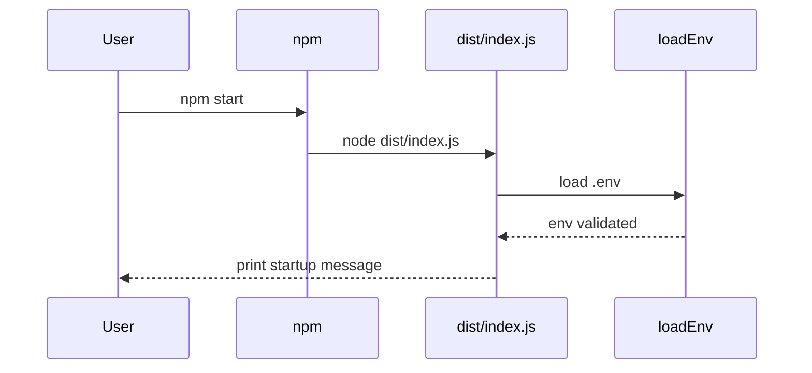
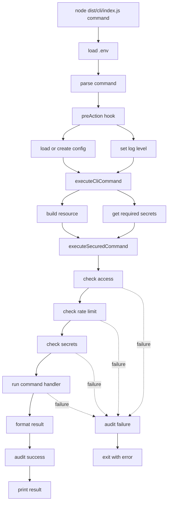
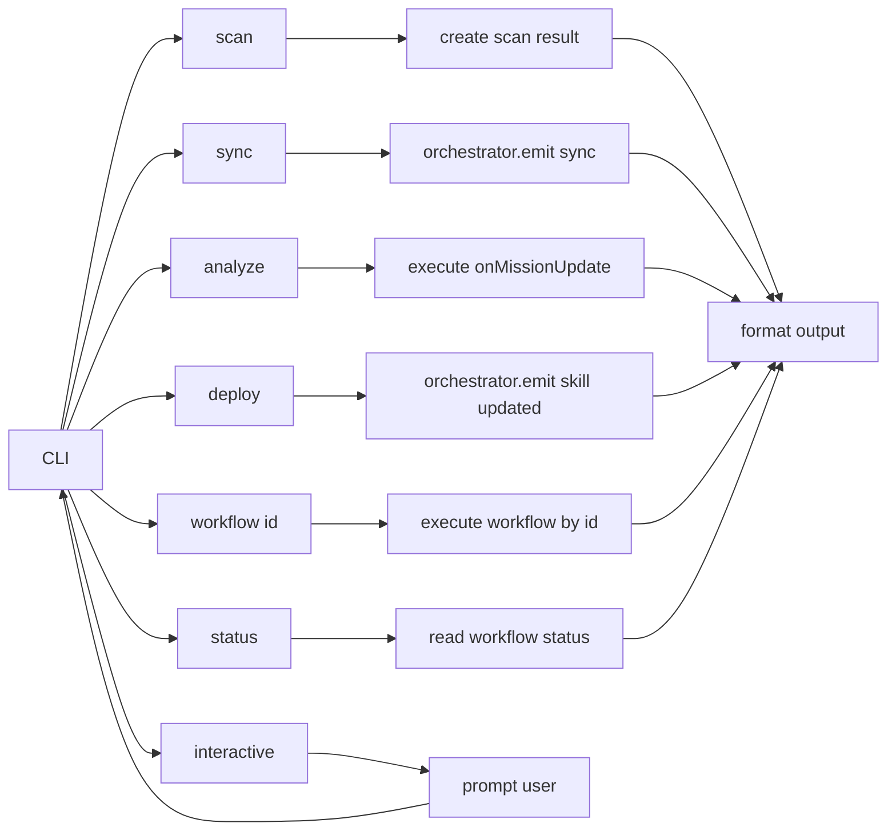
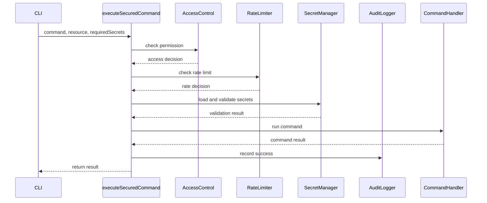
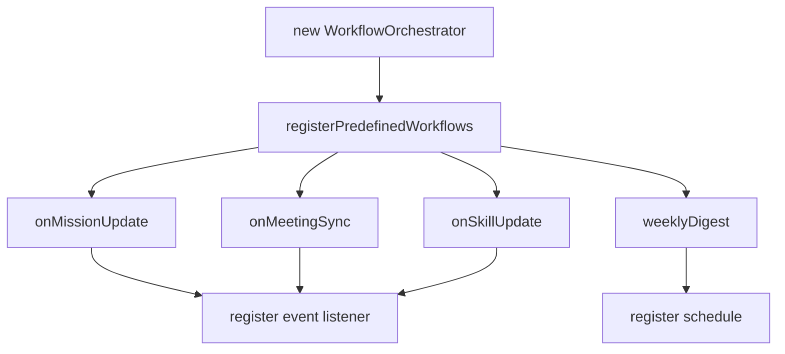
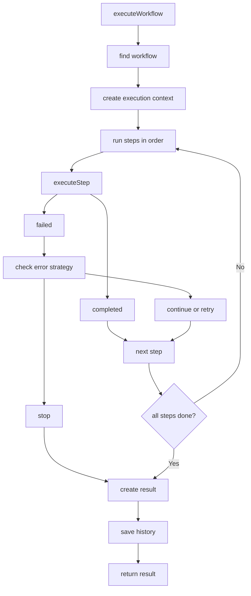
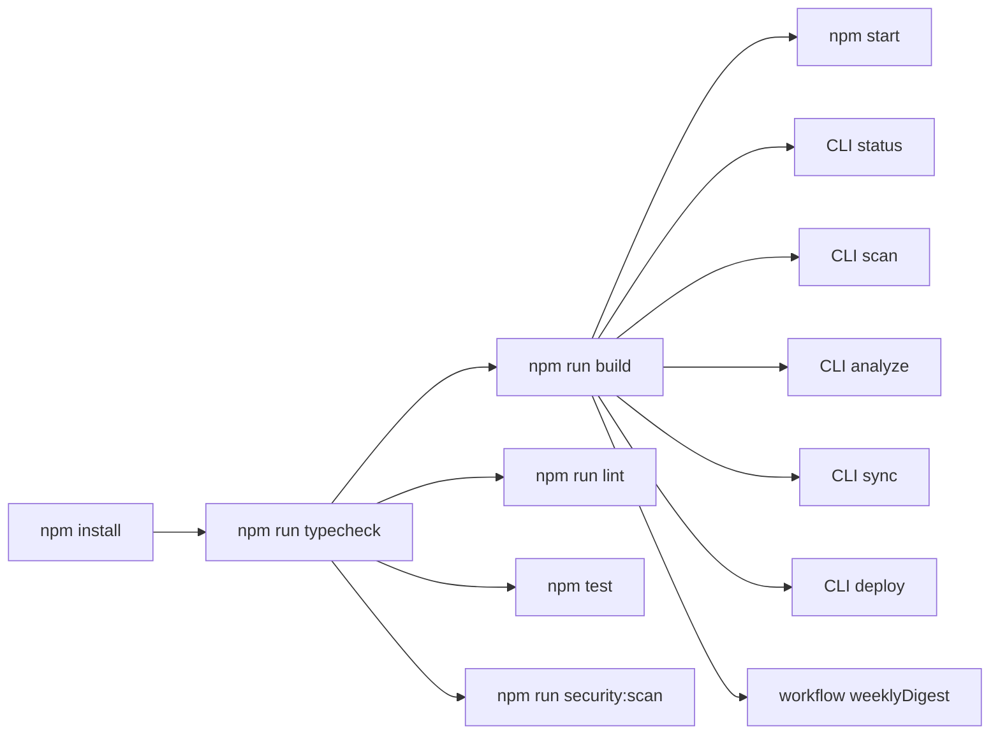

# 프로그램 흐름도

작성일: 2026-05-01  
프로젝트 경로: `D:\TM_PROJECT_셀피시\코드엑스개발`

> Mermaid 렌더링 오류를 피하기 위해 다이어그램 내부 라벨은 영문/ASCII 중심으로 작성했습니다.

## 기본 실행 흐름



현재 기본 실행은 서버를 계속 띄우는 방식이 아니라, 환경 변수를 로드하고 시작 메시지를 출력한 뒤 종료되는 구조입니다.

## CLI 실행 흐름



## CLI 명령별 흐름



## 보안 처리 흐름



## 워크플로우 등록 흐름



## 워크플로우 실행 흐름



## 사전 정의 워크플로우

```mermaid
flowchart TB
  subgraph Mission["onMissionUpdate"]
    M1["mission-log"]
    M2["claude-analyze"]
    M3["linkedin-draft"]
    M1 --> M2 --> M3
  end

  subgraph Meeting["onMeetingSync"]
    N1["notion-fetch"]
    N2["obsidian-sync"]
    N3["report-update"]
    N1 --> N2 --> N3
  end

  subgraph Skill["onSkillUpdate"]
    S1["site-build"]
    S2["vercel-deploy"]
    S3["deploy-notify"]
    S1 --> S2 --> S3
  end

  subgraph Weekly["weeklyDigest"]
    W1["vault-scan"]
    W2["weekly-report"]
    W3["github-commit"]
    W4["digest-notify"]
    W1 --> W2 --> W3 --> W4
  end
```



## 실제 검증 흐름



## 현재 실행 명령 예시

```powershell
npm run build
npm start
node dist\cli\index.js status --output json
node dist\cli\index.js scan --output json
node dist\cli\index.js analyze --week 1 --output json
node dist\cli\index.js sync --target github --output json
node dist\cli\index.js deploy --preview --output json
node dist\cli\index.js workflow weeklyDigest --output json
```

## 해석 주의

CLI와 워크플로우는 현재 로컬 실행 흐름 기준으로 정상 동작합니다. 다만 일부 워크플로우 step은 실제 외부 API 호출이 아니라 완료 메시지를 반환하는 형태입니다. 실제 GitHub, Claude, Notion, Vercel 라이브 연동 검증은 integration 모듈별 API 스모크 테스트를 별도로 실행해야 합니다.

