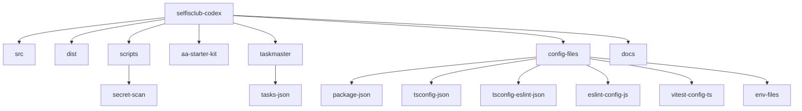
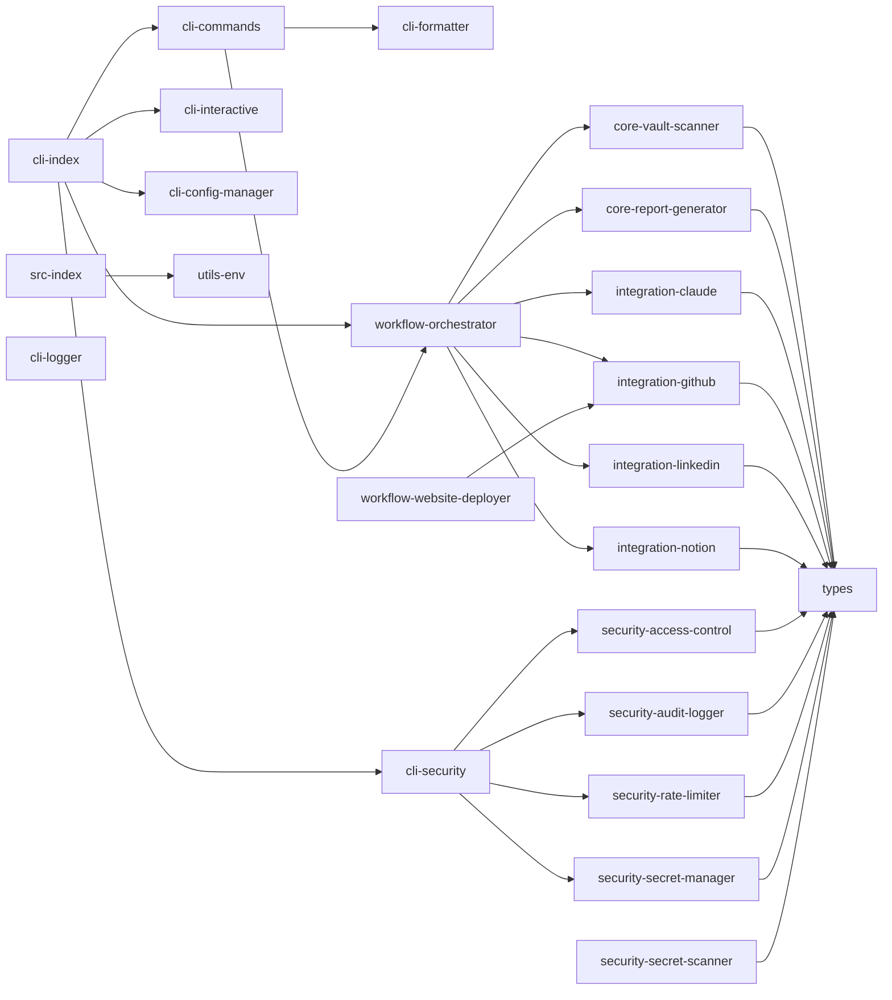
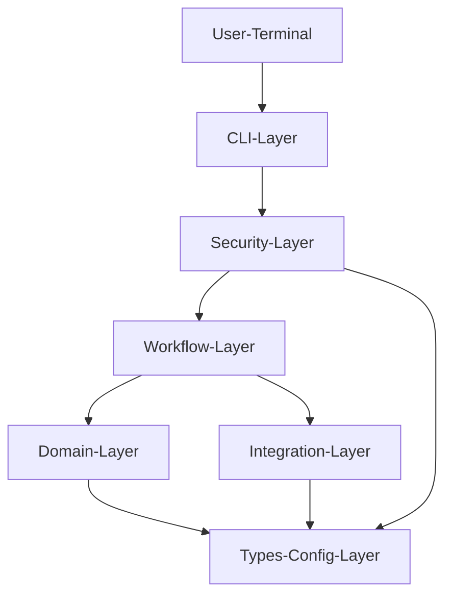
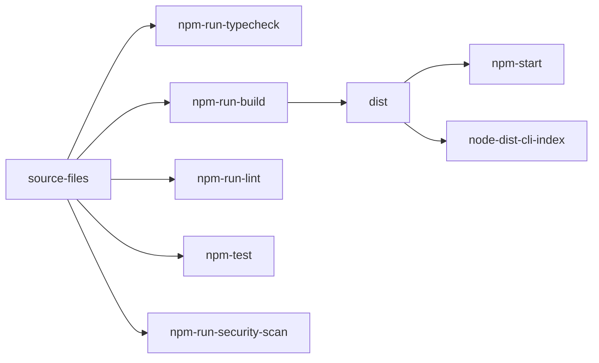

# 프로젝트 전체 구조도

작성일: 2026-05-01  
프로젝트 경로: `D:\TM_PROJECT_셀피시\코드엑스개발`

이 문서의 Mermaid 블록은 MD preview 호환성을 위해 `graph TD` / `graph LR` 문법만 사용합니다.

## 전체 구조

## src 모듈 구조

## 계층 구조

## 주요 파일 역할

| 파일/폴더 | 역할 |
| --- | --- |
| `src/index.ts` | 기본 프로그램 실행 진입점 |
| `src/cli/index.ts` | CLI 명령 등록 및 실행 진입점 |
| `src/cli/commands.ts` | `scan`, `sync`, `analyze`, `deploy`, `workflow`, `status` 처리 |
| `src/cli/security.ts` | CLI 명령 실행 전 권한, 시크릿, rate limit, 감사 로그 처리 |
| `src/workflows/orchestrator.ts` | 사전 정의 워크플로우 등록 및 실행 |
| `src/core/vault-scanner.ts` | Obsidian/Markdown 볼트 스캔 |
| `src/core/report-generator.ts` | Analysis 보고서 생성 |
| `src/integrations/*` | 외부 서비스별 연동 모듈 |
| `src/security/*` | 보안 기능 구현 |
| `src/types/*` | 모듈 간 타입 계약 |
| `scripts/secret-scan.ts` | 시크릿 노출 검사 |

## 빌드와 검증 구조

## 현재 검증 상태

| 항목 | 상태 |
| --- | --- |
| TypeScript typecheck | 통과 |
| Build | 통과 |
| Lint | 통과, warning 있음 |
| Test | 통과, 샌드박스 밖 실행 기준 |
| 기본 실행 | 통과 |
| CLI 주요 명령 | 통과 |

