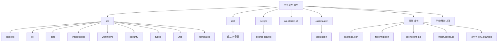
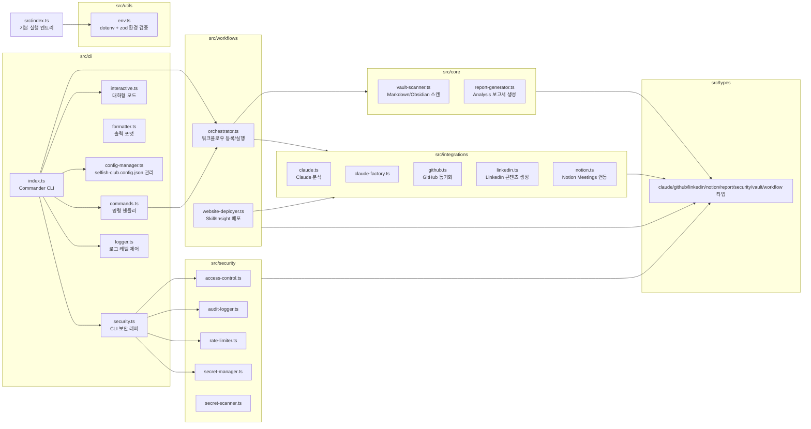
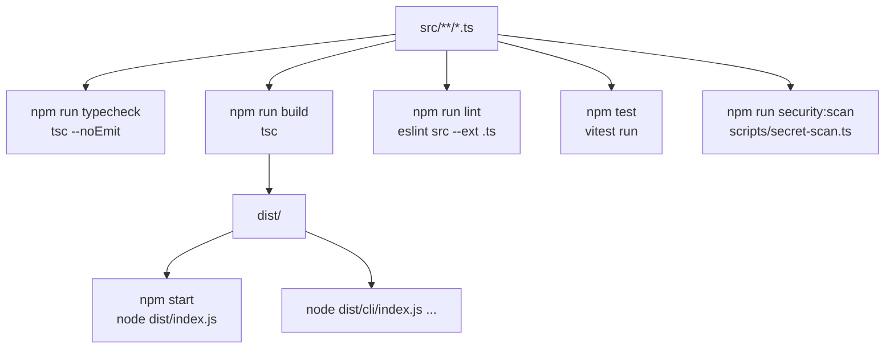

# 프로젝트 전체 구조도

작성일: 2026-05-01  
대상 경로: `D:\TM_PROJECT_셀피시\코드엑스개발`

## 1. 전체 구성 요약

이 프로젝트는 TypeScript 기반 Node.js CLI/자동화 시스템입니다. 중심 흐름은 CLI가 사용자 명령을 받고, 보안 검사를 통과한 뒤 워크플로우 오케스트레이터와 각 도메인 모듈을 호출하는 구조입니다.

## 2. src 내부 구조

## 3. 계층별 역할

| 계층 | 위치 | 역할 |
| --- | --- | --- |
| 실행 진입점 | `src/index.ts`, `src/cli/index.ts` | 기본 실행과 CLI 실행을 시작 |
| 명령 계층 | `src/cli/*` | 사용자 명령 파싱, 출력 포맷, 설정 파일 관리, 보안 래핑 |
| 보안 계층 | `src/security/*`, `src/cli/security.ts` | 권한 확인, rate limit, 시크릿 검증, 감사 로그 |
| 워크플로우 계층 | `src/workflows/*` | 이벤트/cron 기반 자동화 흐름 등록 및 실행 |
| 도메인 계층 | `src/core/*` | 볼트 스캔, 보고서 생성 등 내부 핵심 기능 |
| 외부 연동 계층 | `src/integrations/*` | Claude, GitHub, LinkedIn, Notion, 배포 연동 |
| 타입 계층 | `src/types/*` | 모듈 간 데이터 계약 |
| 설정/검증 | `package.json`, `tsconfig*.json`, `eslint.config.js`, `vitest.config.ts` | 빌드, lint, test, 실행 스크립트 |

## 4. 빌드/검증 구조

## 5. 주요 산출물

| 산출물 | 설명 |
| --- | --- |
| `dist/` | TypeScript 컴파일 결과 |
| `selfish-club.config.json` | CLI 실행 시 생성/사용되는 로컬 설정 |
| `audit/audit.log` | CLI 보안 래퍼가 기록하는 감사 로그 |
| `프로젝트 개요.md` | 현재 상태 요약 |
| `프로그램 시작방법.md` | 실행 방법 |
| `프로젝트 전체 구조도.md` | 이 문서 |
| `프로그램 흐름도.md` | 실행 흐름 문서 |

